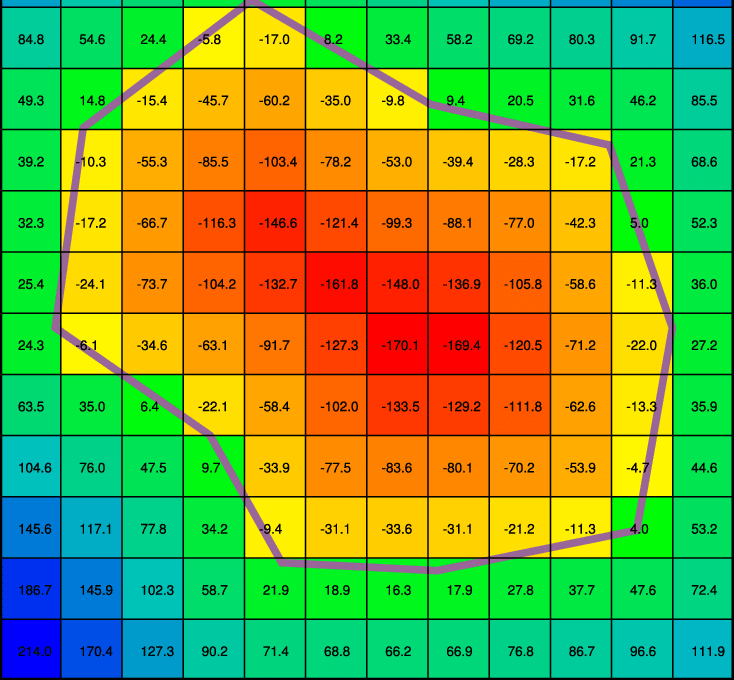
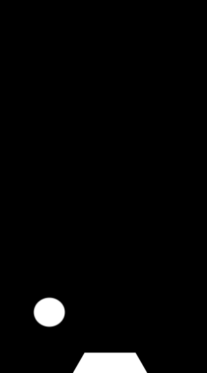
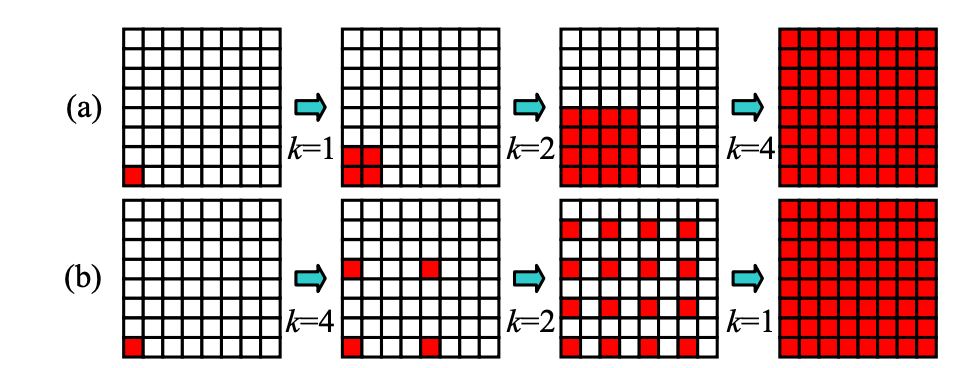
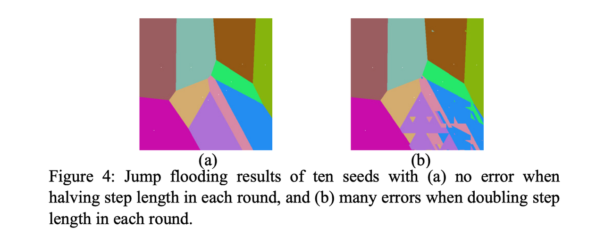
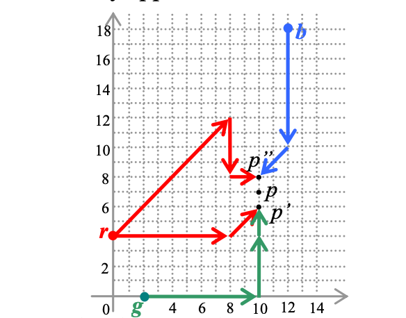
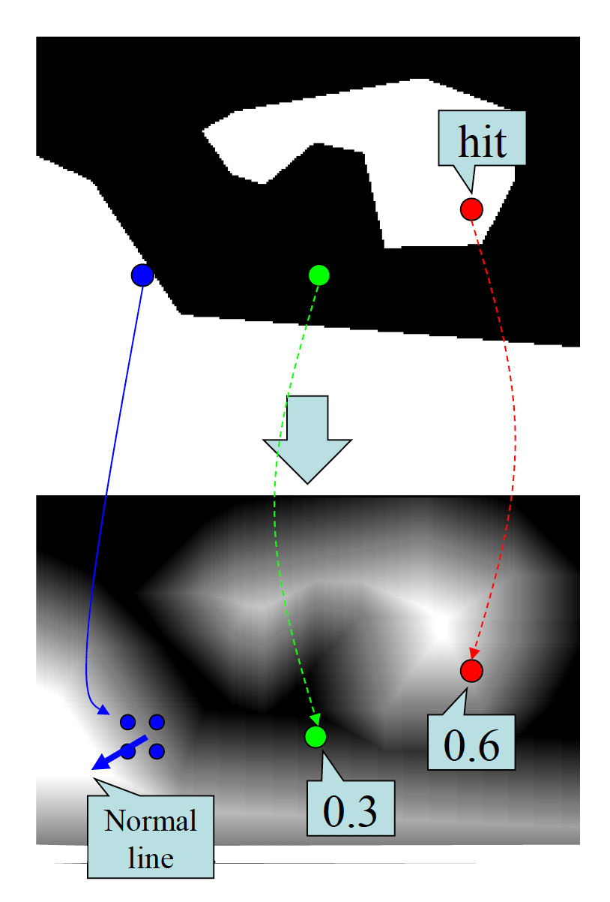
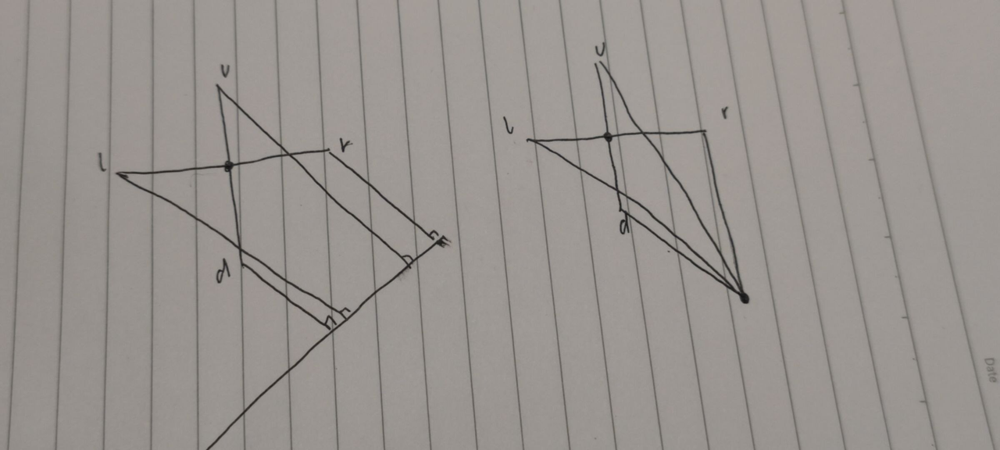

# 基于sdf的流体碰撞
碰撞？SAT GJK
# sdf概念
sdf(signed distance field),即有符号距离场

下图为原图和根据该图生成的归一化后的sdf图

 
左图中白色区域代表物体，右图中颜色值代表到物体的距离，可以看到，白色代表离物体远，黑色代表离物体近，右图以灰度值0.5为分界线，大于0.5代表在物体之外，小于0.5代表在物体之内。

## 优势
有效利用gpu的插值优势，可以在较低分辨率的sdf插图中获取高精度的距离数据。
例如如下3*3的sdf场，如果想要在-1，1，1，2这四个点中心进行差值，会得到0.75，这不同于颜色插值，距离插值是基本符合现实情况的，即四个点中心的真实距离的确是0.75，假设距离场是线性变化的。

    [-2][-1][-1]
    [-1][ 1][ 1]
    [ 1][ 2][ 2]

根据sdf的优势，在不损失碰撞体细节的情况下可以尽量减小sdf图的分辨率以获得更小的空间和时间开销。

# sdf生成算法
算法|时间复杂度|可并行性
--|:--:|:--:
brute force|O(n^2)|yes
8ssedt|O(n)|no
jump flood|O(nlogn)|yes
cda&dra(gpu)|O(n^2)|yes

## Cpu
### 8ssedt
8-points Signed Sequential Euclidean Distance Transform是一种高效的sdf生成算法，这个算法总计会遍历4次遍历（2个来回遍历）
(from left to right, top to bottom)

        - - - >
    | [?][?][?]
    | [?][x][ ]
    v [ ][ ][ ]

then (using the same grid)
(from right to left)

        < - - -
    | [ ][ ][ ]
    | [ ][x][?]
    v [ ][ ][ ]

then
(from right to left, bottom to top)

        < - - -
    ^ [ ][ ][ ]
    | [ ][x][?]
    | [?][?][?]

then:
(from left to right)

        - - - >
    ^ [ ][ ][ ]
    | [?][x][ ]
    | [ ][ ][ ]

## Gpu (parallel)
### cda &dra
Cda dra 在gpu上的实现是一种最坏情况达到On^2的算法，该算法每次迭代都会在自身周围8个采样点寻找最近的可达点并进行记录。

    // The original 3x3 "Chamfer" distance algorithm 
    void CDA(inout vec4 fc, in vec2 coord)
    {
        float d, 
        d1 = 1., d2 = sqrt(2.);
            //d1 = 3., d2 = 4.;
        vec2 c;
        c = coord+vec2(-1,-1); d = tex(c).y + d2; if (d < fc.y) fc.yzw = vec3(d, c);
        c = coord+vec2(-1,+1); d = tex(c).y + d2; if (d < fc.y) fc.yzw = vec3(d, c);
        c = coord+vec2(+1,-1); d = tex(c).y + d2; if (d < fc.y) fc.yzw = vec3(d, c);
        c = coord+vec2(+1,+1); d = tex(c).y + d2; if (d < fc.y) fc.yzw = vec3(d, c);
        c = coord+vec2(-1, 0); d = tex(c).y + d1; if (d < fc.y) fc.yzw = vec3(d, c);
        c = coord+vec2(+1, 0); d = tex(c).y + d1; if (d < fc.y) fc.yzw = vec3(d, c);
        c = coord+vec2( 0,-1); d = tex(c).y + d1; if (d < fc.y) fc.yzw = vec3(d, c);
        c = coord+vec2( 0,+1); d = tex(c).y + d1; if (d < fc.y) fc.yzw = vec3(d, c);
    }

    // 3x3 "Dead Reckoning" distance algorithm
    void DRA(inout vec4 fc, in vec2 coord)
    {
        float d, d1 = 1., d2 = sqrt(2.);
        vec2 c;
        
        c = coord+vec2(-1,-1); if (tex(c).y + d2 < fc.y)
                fc.zw = tex(c).zw, fc.y = length(coord-fc.zw);
        c = coord+vec2( 0,-1); if (tex(c).y + d1 < fc.y)
                fc.zw = tex(c).zw, fc.y = length(coord-fc.zw);
        c = coord+vec2(+1,-1); if (tex(c).y + d2 < fc.y)
                fc.zw = tex(c).zw, fc.y = length(coord-fc.zw);
        c = coord+vec2(-1, 0); if (tex(c).y + d1 < fc.y)
                fc.zw = tex(c).zw, fc.y = length(coord-fc.zw);
        
        c = coord+vec2(+1, 0); if (tex(c).y + d1 < fc.y)
            fc.zw = tex(c).zw, fc.y = length(coord-fc.zw);
        c = coord+vec2(-1,+1); if (tex(c).y + d2 < fc.y)
            fc.zw = tex(c).zw, fc.y = length(coord-fc.zw);
        c = coord+vec2( 0,+1); if (tex(c).y + d1 < fc.y)
            fc.zw = tex(c).zw, fc.y = length(coord-fc.zw);
        c = coord+vec2(+1,+1); if (tex(c).y + d2 < fc.y)
            fc.zw = tex(c).zw, fc.y = length(coord-fc.zw);
    }

### Jump flood
#### 方法：
可以看作是使用了指数步长递减的dra算法

JFA的具体思路就是，使用多个Pass下，每个Pass中像素点找到对应步长的八邻域对应的点中存储的最近点的2D坐标并根据该坐标计算到像素点的距离选择距离最短的坐标存储于该像素点中。其中步长Step，将会不断除2直至为1(logN/2, logN/4, ... 16, 8, 4, 2, 1)后得到最终的SDF Texture。

Jump flooding to propagate the content of a seed at the lowest left corner by (a) doubling step length, and (b) halving step length.

    vec4 StepJFA (in vec2 fragCoord, in float level)
    {
        //计算步长，步长以1/2递减
        level = clamp(level-1.0, 0.0, c_maxSteps);
        float stepwidth = floor(exp2(c_maxSteps - level)+0.5);
        float bestDistance = 9999.0;
        vec2 bestCoord = vec2(0.0);
        vec3 bestColor = vec3(0.0);
        //根据步长采样周围九个点并计算距离
        for (int y = -1; y <= 1; ++y) {
            for (int x = -1; x <= 1; ++x) {
                vec2 sampleCoord = fragCoord + vec2(x,y) * stepwidth;
        
                vec4 data = texture( iChannel0, sampleCoord / iChannelResolution[0].xy);
                vec2 seedCoord;
                vec3 seedColor;
                DecodeData(data, seedCoord, seedColor);
                float dist = length(seedCoord - fragCoord);
                //检查当前距离是否是最佳距离
                if ((seedCoord.x != 0.0 || seedCoord.y != 0.0) && dist < bestDistance)
                {
                    bestDistance = dist;
                    bestCoord = seedCoord;
                    bestColor = seedColor;
                }
            }
        }
        //离当前点距离最近的点的坐标和颜色
        return EncodeData(bestCoord, bestColor);
    }
#### 问题

在上图中，离p点最近的是r点，但是计算后的结果却是g或是b，比如离p'最近的是g，所以p'上记录的是g的坐标，而针对p点，并不能根据p'最近的g点得到真实的最近距离。

针对该问题，作者在文章中进行了分析

http://citeseerx.ist.psu.edu/viewdoc/download?doi=10.1.1.101.8568&rep=rep1&type=pdf

# Sdf 在碰撞中的应用
## 碰撞检测
### 边界判断
在sdf中，可以通过sdf判断到物体的距离，大于0.5时可以视为未和物体碰撞，小于0.5时视为和物体碰撞

### 法向量判断
对碰撞点上下左右进行采样，求取法向量

    //下为两种法向量的计算方法，第二种方法在针对点与平面碰撞时于第一种方法等价，第二种方法是以四个采样点的最近距离都是根据同一个点的情况推导而成的,最后发现其实简单求梯度应该就是最优解了
    float2 normal=float2(disl-disr,disd-disu);
    float2 normal=float2(disl*disl-disr*disr,disd*disd-disu*disu);

下图为分别为点与平面碰撞的情况和四个采样点的最近距离都是同一个点的情况

### 优势
- 可以方便计算碰撞处的法向量，从而进行碰撞结果的计算
- 可以根据实际情况灵活调整阈值，并根据距离自定义碰撞结果

## sdf 动态生成

在实际实现的过程中，为了实现双端的同步，在读入背景贴图后，将所有的数据转换为buffer的形式，在进行完jump flood算法迭代后，将得到的buffer通过一个pass绘制成sdf贴图

针对实际的碰撞需求，需要生成同时包含内部和外部的归一化距离场，在原有的jump flood算法实现上进行了一些修改，使其能够同时向内向外进行flood，主要是通过舍弃原来用存储颜色的位，将它用来记录向内flood的坐标，从而实现向内生成距离场。

## sdf与pbf结合

## 优化方向
通过对程序进行截帧分析，优化了如下的性能点
- 将sdf的计算精度从float转变为half（经过理论和实验分析，发现对于实际效果并没有很大的影响）
- 进行代码细节上的优化，例如将分支压缩到最低、简化计算过程
  
针对不同的使用场景，可以进行如下的进一步优化

- 对于碰撞场改变不频繁的场景将sdf的生成使用事件触发的机制而不是每一帧都进行生成
- 对于sdf图，根据场景所需的碰撞场精度，调整sdf的分辨率，在不损失大量细节的情况下减小分辨率可以大幅降低计算量
- 对于不同的距离场需求，调整jump flood算法的迭代次数，假设迭代次数为n，那么最后生成的图中最远距离就可以达到2^n(单位为贴图的像素)，而实际应用时，可以根据需求适当减少迭代次数

# Reference
https://zhuanlan.zhihu.com/p/26217154

https://www.shadertoy.com/view/3lBBDR#

https://github.com/Lisapple/8SSEDT

http://citeseerx.ist.psu.edu/viewdoc/download?doi=10.1.1.101.8568&rep=rep1&type=pdf

https://blog.demofox.org/2016/02/29/fast-voronoi-diagrams-and-distance-dield-textures-on-the-gpu-with-the-jump-flooding-algorithm/